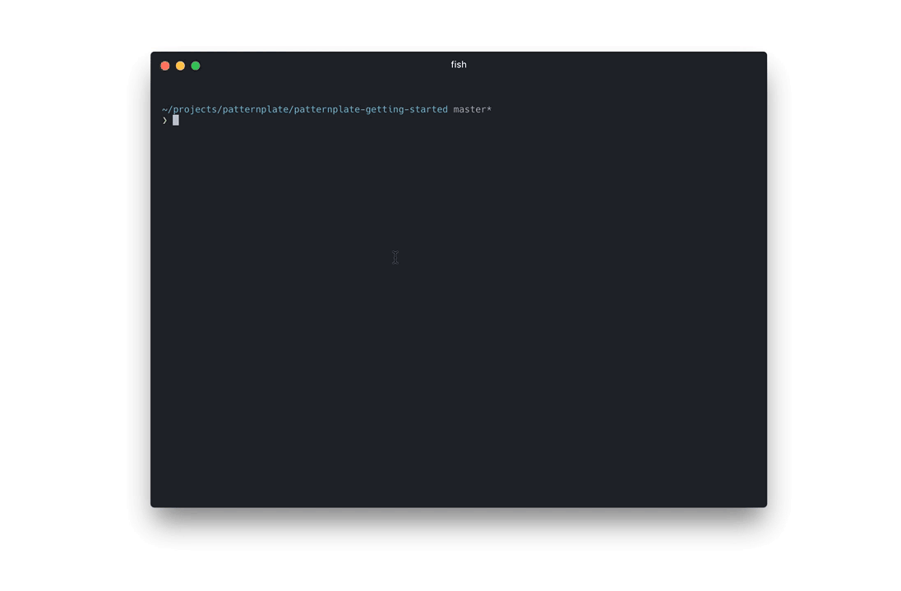

# Documentation

Arguably docs are the single most important part of projects you expect people to actually use.

Simply put:

> If people **don’t know why** your project exists,
they won’t use it.

> If people can’t figure out **how to install** your code,
they won’t use it.

> If people can’t figure out **how to use** your code,
they won’t use it.

Keep in mind: This applies to your future self, too.

## Types of documentation

* Getting started
* Reference guide
* Tutorials
* Learning
* Cookbook

## Rules for better writing

*  Know your audience, consider creating a Persona
*  Define the reader's use case
*  Consider the circumstances of use
*  Make the audience/use case definitions part of the docs
*  Short sentences
*  Avoid filler phrases: that, "I think"
*  Avoid gerund
*  Short paragraphs. 3 sentences max

## Docs for Open Source projects

Things that should be considered the bare minimum in a readme file:

*  State the place in software life cycle
*  Describe very briefly what it actually does
*  Explain why it exists
*  Define steps to install
*  Show examples of how to use
*  Explain how to contribute
*  State the license
*  Link to related projects

## Beyond the readme

A user starting out with an OSS project has the same fundamental need as on any ole' other website.
Toy around with the idea to employ story telling to further steps.

An example for this could be a getting started guide that is available globally and displayed directly when
starting a project for the first time. This idea is untested but can be seen in action at [patternplate](https://github.com/sinnerschrader/patternplate/blob/02b1eca5568c4ce77b0bf32fe7780a3f3a0b9811/documentation/pattern-development.md). The getting started guide about pattern development is thrown into any
project scaffolded via `patternplate init` and displayed as initial content when firing up the interface.

## See also

* [Great Documentation](https://jacobian.org/writing/great-documentation/) by Jacob Kaplan Moss
* [A Beginner's guide to writing documentation](http://www.writethedocs.org/guide/writing/beginners-guide-to-docs/) by the Write The Docs community
* [PharkMillups/beautiful-docs](https://github.com/PharkMillups/beautiful-docs) awesome-list for docs before awesome-list existed
* [RTFM? How to write a mnaul worth reading](https://opensource.com/business/15/5/write-better-docs) by Richard Bowen
* [Standard Readme](https://github.com/RichardLitt/standard-readme)
